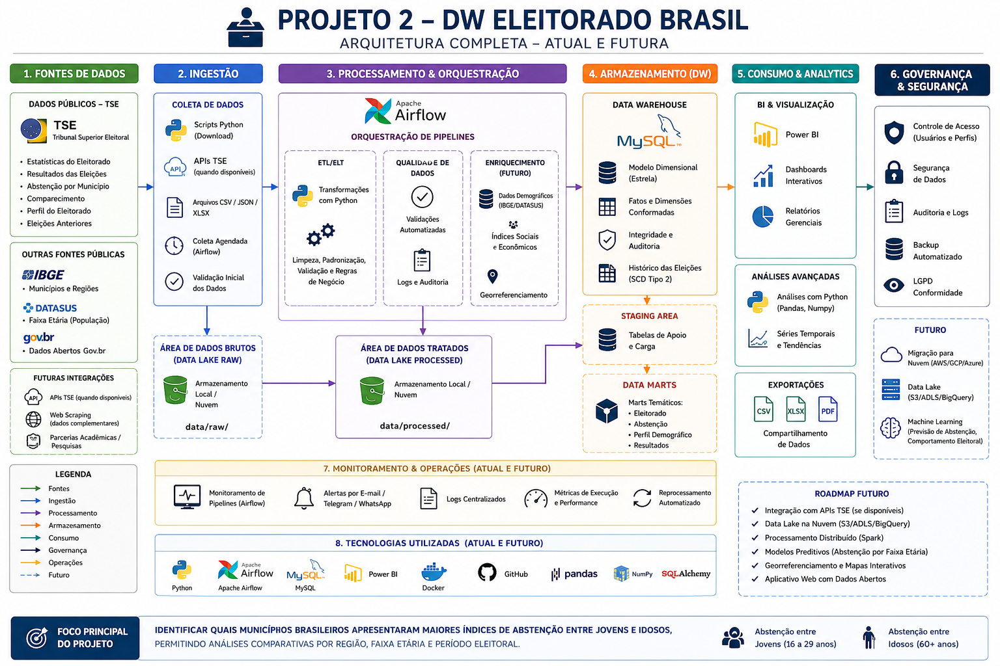

# DW Eleitorado Brasil

## Sobre o Projeto

Este projeto tem como objetivo construir um pipeline de Engenharia de Dados para análise do eleitorado brasileiro, utilizando dados públicos disponibilizados pelo Tribunal Superior Eleitoral.

A proposta é criar um Data Warehouse que permita analisar o perfil do eleitorado por município, estado, faixa etária, gênero, grau de instrução e indicadores de comparecimento e abstenção eleitoral.

Um dos focos principais será identificar quais municípios brasileiros apresentaram maiores índices de abstenção entre jovens e idosos, permitindo análises comparativas por região, faixa etária e período eleitoral.

## 🏗️ Arquitetura do Projeto

<p align="center">
  
</p>


## Objetivos

- Coletar dados públicos do TSE
- Tratar e padronizar os dados eleitorais
- Armazenar os dados em um Data Warehouse
- Criar modelo dimensional
- Automatizar o pipeline com Apache Airflow
- Criar dashboards no Power BI


## Tecnologias Utilizadas

- Python
- Pandas
- MySQL
- Docker
- Apache Airflow
- Power BI
- Git e GitHub

## Indicadores Pretendidos

- Total de eleitores por município
- Total de eleitores por estado
- Jovens eleitores
- Eleitores idosos
- Eleitorado feminino
- Grau de instrução do eleitorado
- Comparecimento eleitoral
- Abstenção eleitoral
- Municípios com maior abstenção de votos entre jovens
- Municípios com maior abstenção de votos entre idosos
- Comparativo de abstenção entre jovens, adultos e idosos
- Evolução da abstenção eleitoral por faixa etária

## Estrutura do Projeto

```
dw-eleitorado-brasil/
│
├── data/
├── dags/
├── scripts/
├── sql/
├── docs/
├── dashboards/
├── README.md
├── .gitignore
├── .env.example
└── requirements.txt

## Status do Projeto

Projeto em fase inicial de estruturação.

Autor

Lúcio Fábio Barbosa de Lima
Estudante de Análise e Desenvolvimento de Sistemas
Estudante do Curso Full Stack de Dados e Analytics - Engenharia de Dados - Pod Academy

## 📫 Contato

LinkedIn:
https://www.linkedin.com/in/lucio-fabio-barbosa

GitHub:
https://github.com/lucio-barbosa/Lucio-Fabio-Engenheiro-de-Dados

Email:
engenheirodedadosluciofabio@gmail.com
